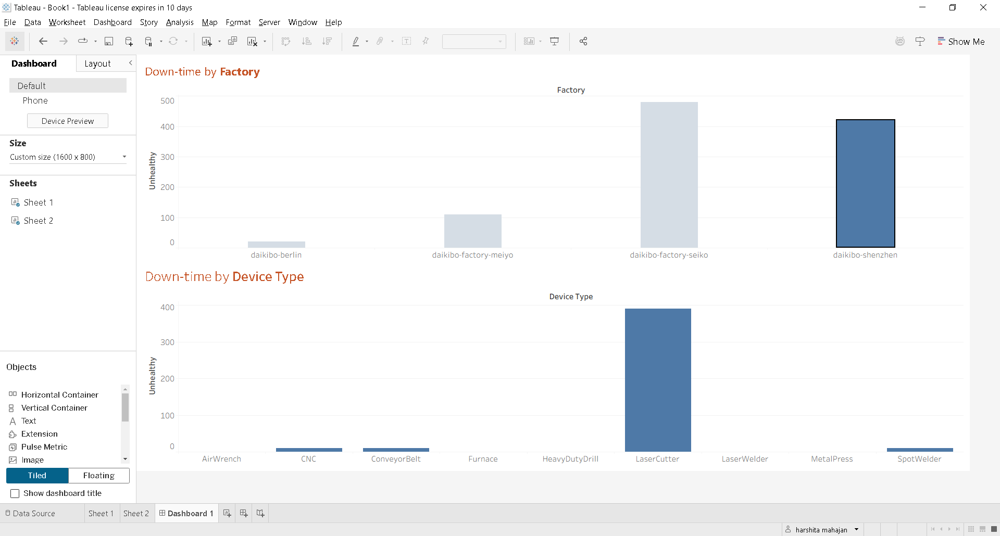
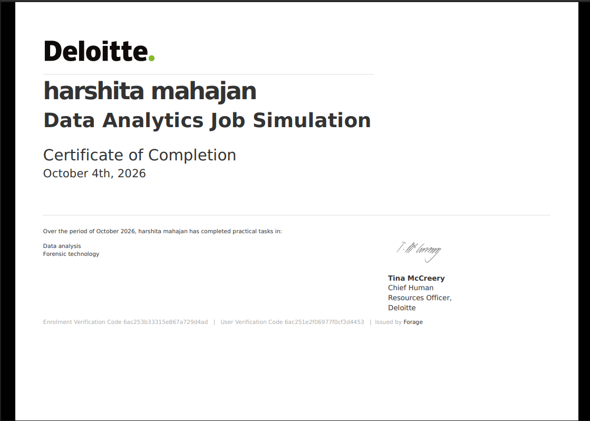

# Deloitte Data Analytics Job Simulation

Completed the **Deloitte Data Analytics Job Simulation** on Forage.

## Tasks

### Tableau — Daikibo Telemetry
- Analyzed factory and device downtime.
- Created an interactive Tableau dashboard with filtering.

### Excel — Equality Analysis
- Analyzed equality scores.
- Classified records as **Fair, Unfair, or Highly Discriminative**.

## Skills

Tableau • Excel • Data Analysis • Data Visualization • Business Analysis • Forensic Technology

## Certificate

